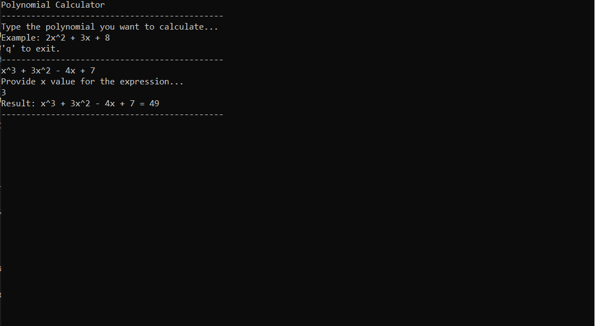

# PolynomialEvaluator 🧮

Simple console C# application, that allows user to enter polynomials, compute their values with defined `x`, and save results to HTML file.

---

## Functionality 🛠️
- Enter a polynomial in the format, example: `2x^2 + 3x - 5`.
- Enter `x` value.
- Calculate the result.
- Save calculation history to `history.html`.
- Support of basic formatting (signs and exponents).
- Support of negative coefficients and unit coefficients example: `-x^2`, `+x`.

---

## Input Restrictions ⚠️
- Polynomials must be entered in the format: `ax^n + bx^(n-1) + ... + c`.
- Coefficients (`a`, `b`, `c`) must be integers.
- Powers (`n`) must be non-negative integers.
- Use `x` for the variable.
- Supported signs: `+` and `-`.
- Do not use spaces inside a single term, e.g., `2 x^2`.
- First term can include `+` or `-` without space. All other terms must be separated by single spaces, including signs.
- Example: `-x^3 + 2x^2 - 3x + 11`.

---

## Example usage
- Entering `x^3 + 3x^2 - 4x + 7`, `x = 3`.



- You can see result in the console.


- And also in the file.

## Methods 📚

### `SplitTerms(string polynomial)`
This method takes polynomial as a string and splits it by spaces. It puts clean terms of polynomial into `termsWithSigns`, but before that checks elements in the splitted string, removes empty ones, and adds signs of coefficients where needed.

### `ParseTerm(string term)`
Takes `term` and divides it into 2 parts: coefficient and power.

### `PowInt(int x, int power)`
Helper method that works like `Math.Pow` but operates on integers.

### `Calculate(int[][] coefPowerPairs, int x)`
Takes the array of arrays, which contain coefficient and power, applies those to `x` and returns result.

### `HtmlFormatTerm(int coef, int power)`
Formats terms to put them in HTML file.

### `BuildHtmlString(string[] htmlFormattedTerms, int calcResult, int x)`
Creates the final string with needed HTML tags and format.

### `SaveResultToFile(string htmlString)`
Saves the result of calculation in the file.

---

## Installation and Usage 💻

1. Clone the repository:
    ```bash
    git clone https://github.com/kd0nwww/PolynomialEvaluator.git
    ```

2. Open `PolynomialEvaluator.csproj` or `PolynomialEvaluator.sln` in Visual Studio.

3. Run the program.

4. See your calculation history in the generated file:

```
📁 PolynomialEvaluator
 └── 📁 bin
      └── 📁 Debug
           └── 📁 net8.0
                └── 📄 history.html
```